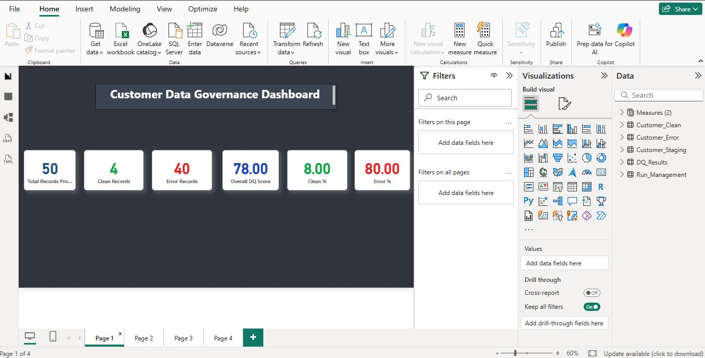
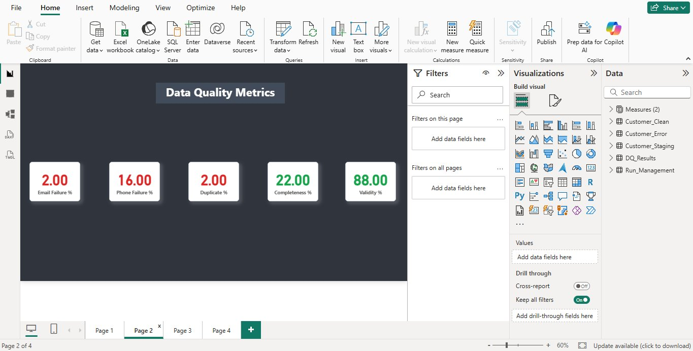
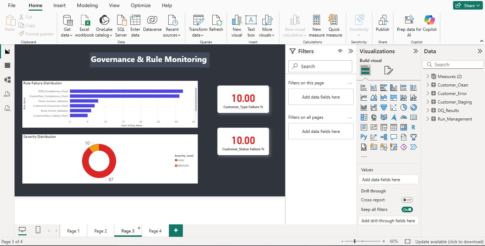
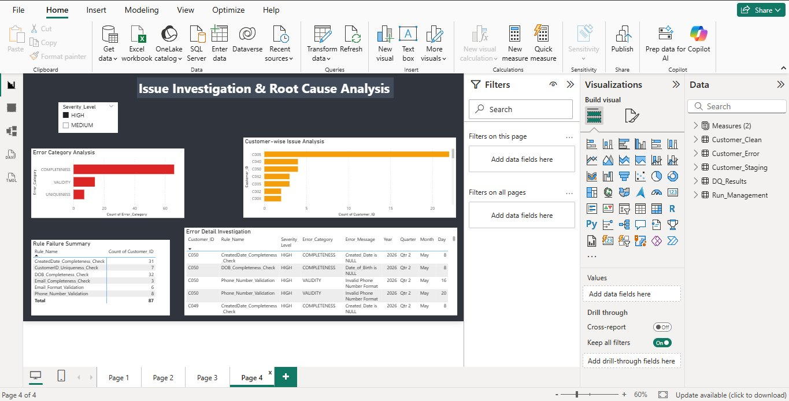

# Enterprise Customer Data Governance & Validation Framework

**Author:** Shubham Prasad  
**Tech Stack:** SQL Server | Power BI | DAX | Microsoft Excel  
**Domain:** Data Governance | Data Quality | Data Stewardship | MDM

---

## Project Overview

An end-to-end enterprise-style **Customer Data Governance and Validation Framework** built to simulate real operational governance workflows across a 15-stage lifecycle — from source file intake through to a fully monitored, trusted data layer with a 4-page interactive Power BI governance dashboard.

This project demonstrates hands-on capability in:
- Designing governed SQL pipelines with full audit traceability
- Implementing Data Quality rules against Critical Data Elements (CDEs)
- Building governance KPI monitoring dashboards in Power BI
- Executing root cause analysis and CAPA (Corrective & Preventive Actions)
- Producing enterprise-grade governance documentation

---

## Dashboard Preview

### Page 1 — Executive Summary

> Total Records: 50 | Clean Records: 4 | Error Records: 40 | Overall DQ Score: 78.00 | Clean %: 8.00 | Error %: 80.00

### Page 2 — Data Quality Metrics

> Email Failure %: 2.00 | Phone Failure %: 16.00 | Duplicate %: 2.00 | Completeness %: 22.00 | Validity %: 88.00

### Page 3 — Governance & Rule Monitoring

> Rule Failure Distribution | Severity Distribution (HIGH: 87, MEDIUM: 10) | Customer_Type Failure %: 10.00 | Customer_Status Failure %: 10.00

### Page 4 — Issue Investigation & Root Cause Analysis

> Error Category Analysis | Customer-wise Issue Analysis | Rule Failure Summary | Error Detail Investigation with Severity_Level slicer

---

## Repository Structure

```
├── 01_Table_Design/              # All governed SQL table creation scripts
├── 02_Data_Governance/           # Source Intelligence, Run Management setup
├── 03_Intake_Validation/         # Intake Audit table and duplicate file prevention
├── 04_EDA_and_Profiling/         # Null, blank, duplicate, domain, pattern analysis
├── 05_Standardization/           # Email, name, city/state standardisation scripts
├── 06_Data_Quality_Rules/        # 6 DQ rules targeting 5 Critical Data Elements
├── 07_Stored_Procedure/          # usp_Load_Customer_Data — full pipeline with TRY/CATCH
├── 08_Testing/                   # Row count, null, duplicate, business rule testing
├── 09_Governance_Documents/      # Full governance documentation suite (Excel + Word)
└── 10_Dashboard_Screenshots/     # All 4 Power BI dashboard page screenshots
```

---

## Governance Architecture

### Data Pipeline Flow
```
CSV Source File
    → Customer_Staging_Load  (raw buffer)
    → usp_Load_Customer_Data (stored procedure with TRY/CATCH)
    → Customer_Staging       (type-safe staging layer)
    → DQ Rules Execution     (6 validation rules)
    → Customer_Clean         (trusted layer — passed records)
    → Customer_Error         (exception layer — failed records)
    → DQ_Results             (KPI output per run)
    → Power BI Dashboard     (governance monitoring)
```

### Governed Tables (7)
| Table | Purpose |
|-------|---------|
| Run_Management | Pipeline execution tracking with status constraints |
| Source_Intelligence | Source file metadata and governance classification |
| Customer_Staging_Load | Raw CSV ingestion buffer |
| Customer_Staging | Type-safe governed staging layer |
| Customer_Clean | Trusted layer — records passing all DQ rules |
| Customer_Error | Exception layer — failed records with governance columns |
| DQ_Results | KPI summary output per run |

---

## Data Quality Rules (6)

| Rule ID | Rule Name | Category | Severity | Target CDE |
|---------|-----------|----------|----------|-----------|
| ERR001 | Email_Completeness_Check | Completeness | HIGH | Email |
| ERR002 | CustomerID_Uniqueness_Check | Uniqueness | HIGH | Customer_ID |
| ERR003 | CustomerStatus_Validity_Check | Validity | MEDIUM | Customer_Status |
| ERR004 | CustomerType_Validity_Check | Validity | MEDIUM | Customer_Type |
| ERR006 | Email_Format_Validation | Validity | HIGH | Email |
| ERR007 | Phone_Number_Validation | Validity | HIGH | Phone_Number |

---

## Critical Data Elements (5 CDEs)

| CDE | Business Justification |
|-----|----------------------|
| Customer_ID | Primary identifier — uniqueness, traceability, reporting accuracy |
| Email | Communication reliability — notifications, engagement, verification |
| Phone_Number | Contactability — outreach, support, verification |
| Customer_Status | Operational classification — segmentation, processing decisions |
| Customer_Type | Customer categorisation — analytics, reporting reliability |

---

## Power BI KPI Framework (13 KPIs)

| KPI | Formula | Dashboard Page |
|-----|---------|---------------|
| Overall DQ Score | (Clean / Total) × 100 | Page 1 |
| Clean % | (Clean / Total) × 100 | Page 1 |
| Error % | (Error / Total) × 100 | Page 1 |
| Total Records Processed | COUNTROWS(DQ_Results) | Page 1 |
| Clean Records | COUNTROWS(Customer_Clean) | Page 1 |
| Error Records | COUNTROWS(Customer_Error) | Page 1 |
| Email Failure % | (Email Fail / Total) × 100 | Page 2 |
| Phone Failure % | (Phone Fail / Total) × 100 | Page 2 |
| Duplicate % | (Duplicate Count / Total) × 100 | Page 2 |
| Completeness % | (Non-null Count / Total) × 100 | Page 2 |
| Validity % | (Valid Count / Total) × 100 | Page 2 |
| Customer_Status Failure % | (Status Fail / Total) × 100 | Page 3 |
| Customer_Type Failure % | (Type Fail / Total) × 100 | Page 3 |

---

## Governance Documentation Suite

| Document | Purpose |
|----------|---------|
| Observation_Register.xlsx | Classified profiling findings with governance impact |
| Observation_Action_Mapping_v2.xlsx | Maps observations to governance actions |
| Business_Understanding_.xlsx | Business justification for each data field |
| Profiling_Framework.xlsx | EDA and profiling methodology |
| Profiling_Objective_v1.xlsx | Profiling objectives and scope |
| Cleaning_Decision_Framework.xlsx | Rules for data cleansing decisions |
| KPI_Definition.xlsx | Full KPI definitions with formulas |
| KPI_Definition_Document.docx | Detailed KPI documentation |
| Intake_Validation_Rules.xlsx | Source file intake governance rules |
| Run_Management_Rules.xlsx | Pipeline run management governance |
| Run_Stage_Data_Dictionary.xlsx | Data dictionary for each run stage |
| Source_Intelligence_Rules.xlsx | Source intelligence governance rules |
| Source_Intelligence_Data_Dictionary.xlsx | Source metadata definitions |
| Dashboard_Walkthrough_Document.docx | Full dashboard walkthrough guide |
| Dashboard_Business_Story_Mapping.docx | Business narrative for each dashboard page |
| Enterprise_Data_Governance_and_Data_Steward_Interview_Playbook.docx | Interview preparation guide |

---

## Key Technical Highlights

- **TRY/CATCH error handling** in stored procedure with automatic Run_Management status updates
- **Constraint-based governance** in table design — CHECK constraints on Status, File_Format, Record_Count
- **Severity classification** — Critical / HIGH / MEDIUM / LOW with governance columns in Customer_Error
- **Cross-filter behaviour** in Power BI — Severity_Level slicer on Page 4 filters all visuals simultaneously
- **DAX measures** for all KPI calculations — not column-level aggregations
- **Intake Audit layer** — duplicate file detection with automatic REJECTED/FAILED status updates

---

*This project was built to demonstrate enterprise-style data governance capability at entry level, bridging the gap between theoretical governance frameworks and hands-on technical implementation.*
